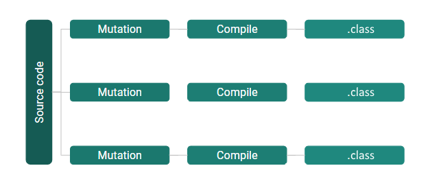
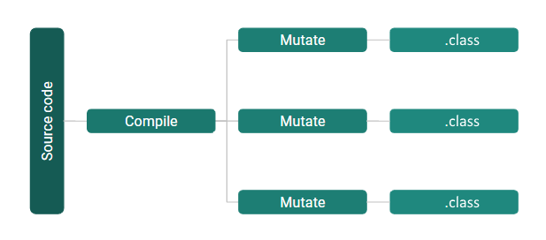
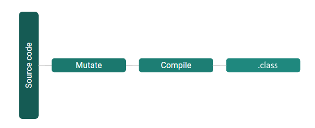

<!-- .slide: data-background-color="#22323d" -->


### Who is Testing Your Tests?

----


## Welcome! 🙋‍♂️

- What's the deal with code coverage anyway?
- Mutation testing
- Stryker4s
- Beyond Scala

---

<!-- .slide: data-auto-animate data-id="slide-tests" -->

### Unit tests

```scala " data-line-numbers=true
case class Person(name: String, age: Int)

def isAllowedToBuyAlcohol(customer: Person) = {
  customer.age >= 18
}
```

----

<!-- .slide: data-auto-animate data-id="slide-tests" -->

```scala " data-line-numbers=true
case class Person(name: String, age: Int)

def isAllowedToBuyAlcohol(customer: Person) = {
  customer.age >= 18
}
```

```scala " data-line-numbers=true
test("Adults can buy alcohol") {
  val customer = Person("Mark", 24)
  isAllowedToBuyAlcohol(customer)
}
```
<!-- .element data-id="code-animation" -->

100% Code coverage 🙈
<!-- .element class="fragment" -->

----

<!-- .slide: data-auto-animate data-id="slide-tests" -->

```scala " data-line-numbers=true
case class Person(name: String, age: Int)

def isAllowedToBuyAlcohol(customer: Person) = {
  customer.age >= 18
}
```

```scala " data-line-numbers=true
test("Adults can buy alcohol") {
  val customer = Person("Mark", 24)
  assert(isAllowedToBuyAlcohol(customer))
}
```
<!-- .element data-id="code-animation" -->

Still 100% code coverage 🤔
<!-- .element class="fragment" -->

----

<!-- .slide: data-auto-animate data-id="slide-tests" -->

```scala " data-line-numbers=true
case class Person(name: String, age: Int)

def isAllowedToBuyAlcohol(customer: Person) = {
  customer.age >= 18
}
```

```scala " data-line-numbers=true
test("Adults can buy alcohol") {
  val customer = Person("Mark", 19)
  assert(isAllowedToBuyAlcohol(customer))
}

test("18-year-olds can buy alcohol") {
  val customer = Person("Sarah", 18)
  assert(isAllowedToBuyAlcohol(customer))
}

test("Minors can not buy alcohol") {
  val customer = Person("Pete", 17)
  assert(!isAllowedToBuyAlcohol(customer))
}
```
<!-- .element data-id="code-animation" -->


Also 100% code coverage! 🤯
<!-- .element class="fragment" -->

----

### Property testing to the rescue?

```scala " data-line-numbers=true
def people: Gen[Person] = ???
def adults: Gen[Person] = persons.filter(_.age > 18)
def minors: Gen[Person] = persons.filter(_.age < 18)

property("Adults can buy alcohol") {
  forAll(adults) { (customer: Person) =>
    assert(isAllowedToBuyAlcohol(customer))
  }
}
property("Minors can not buy alcohol") {
  forAll(minors) { (customer: Person) =>
    assert(!isAllowedToBuyAlcohol(customer))
  }
}

```

The very same 100% code coverage! 😢
<!-- .element class="fragment" -->

----


---

<!-- .slide: data-auto-animate data-id="slide-mt" -->

## 🦸‍♀️ Mutation testing to the rescue!

----

<!-- .slide: data-auto-animate data-id="slide-mt" -->

### How it works

```scala " data-line-numbers=true
case class Person(name: String, age: Int)

def isAllowedToBuyAlcohol(customer: Person) = {
  customer.age >= 18
}
```
<!-- .element data-id="code-animation" -->

----

<!-- .slide: data-auto-animate data-id="slide-mt" -->

### How it works

<span class="logo">😃</span><span class="logo-arrow">🡲</span> <!-- .element class="fragment" data-fragment-index="1" --> 
<span class="logo fragment" data-fragment-index="1">👽</span><span class="logo-arrow">🡲</span> <!-- .element class="fragment" data-fragment-index="2" -->
<span class="logo fragment" data-fragment-index="2">✅</span>
<span class="logo fragment" data-fragment-index="2">❌</span>
<span class="logo-arrow">🡲</span> <!-- .element class="fragment" data-fragment-index="3" -->
<span class="fragment logo" data-fragment-index="3">📊</span>

1. Source code
1. <!-- .element class="fragment" data-fragment-index="1" -->Mutants
1. <!-- .element class="fragment" data-fragment-index="2" -->Killed / survived
1. <!-- .element class="fragment" data-fragment-index="3" -->Report

```scala " data-line-numbers=true
case class Person(name: String, age: Int)

def isAllowedToBuyAlcohol(customer: Person) = {
  // Mutant 1: customer.age > 18
  // Mutant 2: customer.age < 18
  // Mutant 3: customer.age == 18
  customer.age >= 18
}
```
<!-- .element data-id="code-animation" -->

----

## Pros and cons

* 👍 High quality effectiveness report
* 👎 Might take a long time to execute
* 👎 <!-- .element class="fragment" data-fragment-index="1" --> Less known than code coverage

<!-- .element class="no-list"  -->

(we need your help!)

<!-- .element class="fragment" data-fragment-index="1" -->

----

## Stryker4s!


| Original         | Mutated             |
| ---------------- | ----------------    |
| `a.filter(b)`    | `a.filterNot(b)`    |
| `a.exists(b)`    | `a.forall(b)`       |
| `a > b`          | `a >= b`            |
| `if(a) { ... }`  | `if(false) { ... }` |
| `a && b`         | `a \|\| b`          |
| `"my string"`    | `""`                |
| Lots more! 🎁      |        |

<!-- .element class="table-small-text" -->

----

# Demo time


https://stryker-mutator.io

---

## Mutating Scala code

----

## The source code way



----

## The Pitest way



----
<!-- .slide: data-auto-animate -->

```scala " data-line-numbers=true
case class Person(name: String, age: Int)
```
----
<!-- .slide: data-auto-animate -->

```java " data-line-numbers=true
public class Person implements scala.Product,java.io.Serializable {
  public static scala.Option<scala.Tuple2<java.lang.String, java.lang.Object>> unapply(Person);
  public static Person apply(java.lang.String, int);
  public static scala.Function1<scala.Tuple2<java.lang.String, java.lang.Object>, Person> tupled();
  public static scala.Function1<java.lang.String, scala.Function1<java.lang.Object, Person>> curried();
  public scala.collection.Iterator<java.lang.String> productElementNames();
  public java.lang.String name();
  public int age();
  public Person copy(java.lang.String, int);
  public java.lang.String copy$default$1();
  public int copy$default$2();
  public java.lang.String productPrefix();
  public int productArity();
  public java.lang.Object productElement(int);
  public scala.collection.Iterator<java.lang.Object> productIterator();
  public boolean canEqual(java.lang.Object);
  public java.lang.String productElementName(int);
  public int hashCode();
  public java.lang.String toString();
  public boolean equals(java.lang.Object);
  public Person(java.lang.String, int);
}
```

----

## Mutation switching


----
## The Stryker4s way



----

<!-- .slide: data-auto-animate -->

## Mutation switching in practice

```scala " data-line-numbers=true
def isAllowedToBuyAlcohol(customer: Person) = {
  // Mutant 1: customer.age > 18
  // Mutant 2: customer.age < 18
  // Mutant 3: customer.age == 18
  customer.age >= 18
}
```
<!-- .element data-id="code-animation" -->

----

<!-- .slide: data-auto-animate -->

## Mutation switching in practice

```scala " data-line-numbers=true
def greaterThan(a: Int, b: Int): Boolean = {
  stryker4s.activeMutation match {
    case 0 => customer.age > 18 // Mutant 1
    case 1 => customer.age < 18  // Mutant 2
    case 2 => customer.age == 18 // Mutant 3
    case _ => customer.age >= 18  // Original
  }
}
```
<!-- .element data-id="code-animation" -->

---

### Frameworks

| Language | Framework    |
| -------- | :----------- |
| Scala    | Stryker4s    |
| JS/TS    | Stryker      |
| C#       | Stryker.NET  |
| Java     | PITest       |
| PHP      | InfectionPHP |
| Ruby     | Mutant       |
| Python   | Cosmic Ray   |
| C/C++    | Mull         |

<!-- .element class="table-small-text" -->

---

<iframe data-src="https://giphy.com/embed/5ArJanyCfxgiY" width="400" height="400" frameBorder="0" class="giphy-embed" ></iframe>
<br>

- 🌐 https://stryker-mutator.io
- 👩‍💻 https://github.com/stryker-mutator
- 🐦 https://twitter.com/stryker_mutator
- 💬 [Slack](https://join.slack.com/t/stryker-mutator/shared_invite/enQtOTUyMTYyNTg1NDQ0LTU4ODNmZDlmN2I3MmEyMTVhYjZlYmJkOThlNTY3NTM1M2QxYmM5YTM3ODQxYmJjY2YyYzllM2RkMmM1NjNjZjM)
- 👨‍🏫 https://git.io/who-is-testing-your-tests

<!-- .element class="no-list" -->
